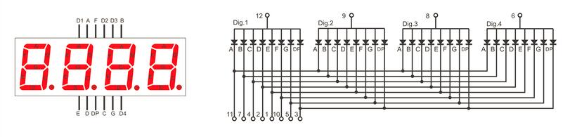

### Tutorial 2: Seven Segment Display

In this tutorial, we will control a seven segment display using the FPGA. This will introduce concepts such as `module` instantiation where code can be written and reused, a similar paradigm to Object Oriented Programming.

A seven segment display is basically a package of seven/eight LEDs that allow you to form numbers 0-f by lighting them up in specific formats. In this tutorial, we use a **common anode version**, where the anodes are connected, and pulled `HIGH`


We start by looking at which combinations of LEDs to light up, to show a specific digit on the display. The truth table for the LED inputs for a given output digit is shown below.


Let's create a module to light up the LEDs in the correct combination. The module takes a 4-bit input (0 to F in hex) and lights up the corresponding digit. We start by including the truth table as a set of parameters that we can call during operation.

```verilog
module Seven_Segment
(
    input wire CLK_IN,
    input wire [3:0] NUMBER_IN,
    output reg [6:0] OUTPUT
);

    parameter zero   = 7'b1111110;  //Value for zero
    parameter one    = 7'b0110000;  //Value for one
    parameter two    = 7'b1101101;  //Value for two
    parameter three  = 7'b1111001;  //Value for three
    parameter four   = 7'b0110011;  //Value for four
    parameter five   = 7'b1011011;  //Value for five
    parameter six    = 7'b1011111;  //Value for six
    parameter seven  = 7'b1110000;  //Value for seven
    parameter eight  = 7'b1111111;  //Value for eight
    parameter nine   = 7'b1110011;  //Value for nine
    parameter A      = 7'b1110111;  //Value for A
    parameter B      = 7'b0011111;  //Value for B 
    parameter C      = 7'b1001110;  //Value for C
    parameter D      = 7'b0111101;  //Value for D
    parameter E      = 7'b1001111;  //Value for E
    parameter F      = 7'b1000111;  //Value for F

endmodule
```

Then, we'll want to define the behaviour of the module at each clock pulse with an `always` block. We synchronise this module to a clock's rising edge `posedge`, so that we can update the value on the display whenever we get a new input. You can also use the falling edge with `negedge`. Most modules in FPGAs will be synchronised to a clock, allowing you to pipeline data from one module to another sequentially. This is a very important concept in FPGA design, as you will see in more advanced tutorials.

```verilog
module Seven_Segment
(
    input wire CLK_IN,
    input wire [3:0] NUMBER_IN,
    output reg [6:0] OUTPUT
);

    parameter zero   = 7'b1111110;  //Value for zero
    parameter one    = 7'b0110000;  //Value for one
    parameter two    = 7'b1101101;  //Value for two
    parameter three  = 7'b1111001;  //Value for three
    parameter four   = 7'b0110011;  //Value for four
    parameter five   = 7'b1011011;  //Value for five
    parameter six    = 7'b1011111;  //Value for six
    parameter seven  = 7'b1110000;  //Value for seven
    parameter eight  = 7'b1111111;  //Value for eight
    parameter nine   = 7'b1110011;  //Value for nine
    parameter A      = 7'b1110111;  //Value for A
    parameter B      = 7'b0011111;  //Value for B 
    parameter C      = 7'b1001110;  //Value for C
    parameter D      = 7'b0111101;  //Value for D
    parameter E      = 7'b1001111;  //Value for E
    parameter F      = 7'b1000111;  //Value for F

    always @(posedge CLK_IN) begin
        // Do something
    end
endmodule
```

Inside the `always` block, we define the behaviour of the outputs. We invert the output with a `~` operator, as we are using a common anode display. We need to drive the selected LED a/b/c/d/e/f/g `LOW` to turn it on. Save this file as `Seven_Segment.v`. If your segment display uses common cathode instead, remove the `~` operator from the code. For example, in case `4'b0000`, the code should be `OUTPUT <= zero;` instead of `OUTPUT <= ~zero;`. Repeat for all 17 cases, including the default case.

```verilog
module Seven_Segment (
    input wire CLK_IN,
    input wire [3:0]NUMBER_IN,
    output reg [6:0] OUTPUT
    );

    parameter zero   = 7'b1111110;  //Value for zero
    parameter one    = 7'b0110000;  //Value for one
    parameter two    = 7'b1101101;  //Value for two
    parameter three  = 7'b1111001;  //Value for three
    parameter four   = 7'b0110011;  //Value for four
    parameter five   = 7'b1011011;  //Value for five
    parameter six    = 7'b1011111;  //Value for six
    parameter seven  = 7'b1110000;  //Value for seven
    parameter eight  = 7'b1111111;  //Value for eight
    parameter nine   = 7'b1110011;  //Value for nine
    parameter A      = 7'b1110111;  //Value for A
    parameter B      = 7'b0011111;  //Value for B 
    parameter C      = 7'b1001110;  //Value for C
    parameter D      = 7'b0111101;  //Value for D
    parameter E      = 7'b1001111;  //Value for E
    parameter F      = 7'b1000111;  //Value for F

    always @(posedge CLK_IN) begin
        case(NUMBER_IN)
            4'b0000: OUTPUT <= ~zero;
            4'b0001: OUTPUT <= ~one;
            4'b0010: OUTPUT <= ~two;
            4'b0011: OUTPUT <= ~three;
            4'b0100: OUTPUT <= ~four;
            4'b0101: OUTPUT <= ~five;
            4'b0110: OUTPUT <= ~six;
            4'b0111: OUTPUT <= ~seven;
            4'b1000: OUTPUT <= ~eight;
            4'b1001: OUTPUT <= ~nine;
            4'b1010: OUTPUT <= ~A;
            4'b1011: OUTPUT <= ~B;
            4'b1100: OUTPUT <= ~C;
            4'b1101: OUTPUT <= ~D;
            4'b1110: OUTPUT <= ~E;
            4'b1111: OUTPUT <= ~F;
            default: OUTPUT <= ~zero;
        endcase
    end
endmodule
```

Now, we've created a module that takes in a 4-bit input and displays the corresponding digit on the seven segment display. Let's do something more advanced. Now, we have a 4-digit seven segment display, as shown below. Let's show a 16-bit number on it! Note that your segment display may have a different pin arrangement than shown below. Check the datasheet for your segment display. While you're at it, check if its a common anode or cathode display. It'll save you headache later on.


Now we have some additional pins, D1-D4. These are used to select the corresponding digit in the display, by driving it `HIGH` and the segment side `LOW` to create a voltage difference across the LED segment, lighting it up.



How do you light up so many digits if they share a common pin? The answer is simple: LED multiplexing! What you need to do is continuously switch on and off the correct digit so fast that it appears as one continuous image to the naked eye. For that, you'll need a refresh rate of at least 60Hz. We can comfortably achieve that and a lot more with our mighty FPGA.

In our module, we'll define a 16-bit input, representing the number we want to display. Our outputs will be all the pins of this 4-digit seven segment display. First, we start by including our `Seven_Segment.v` module with `include`.

```verilog
`include "Seven_Segment.v"

module Seven_Segment_Display (
    input wire clk,
    input wire RST_N,
    input wire [15:0] Displayed_number,
    output reg [3:0] Cathode,
    output wire [6:0] Segment_out
    );
    
endmodule
```

We instantiate our `Seven_Segment.v` module as shown below, adding a signal `Digitnumber` to send the 4-bit digit to the module.

```verilog
`include "Seven_Segment.v"

module Seven_Segment_Display (
    input wire clk,
    input wire RST_N,
    input wire [15:0] Displayed_number,
    output reg [3:0] Cathode,
    output wire [6:0] Segment_out
    );

    reg [3:0] Digit_number;

    // Creating Seven_Segment instance
    Seven_Segment i2
    (
        .CLK_IN(clk),
        .NUMBER_IN(Digit_number),
        .OUTPUT(Segment_out[6:0])
    );
    
endmodule
```

Then, we add in our logic to alternate between the 4 digits of the seven segment display, to rapidly display all digits on them. We use a 2-bit counter `LEDactivatingcounter` to choose which one to light up, and `DigitNumber` to represent the 4-bit digit displayed on the current display. If your segment display uses common cathode, your `Cathode` variable will be the bitwise not equivalent of what is shown in the code below. For example, in the case of `2'b00`, `Cathode = 4'b0111` instead of `4'b1000`. Repeat for all five cases, including the default case.

```verilog
`include "Seven_Segment.v"

module Seven_Segment_Display (
    input wire clk,
    input wire RST_N,
    input wire [15:0] Displayed_number,
    output reg [3:0] Cathode,
    output wire [6:0] Segment_out
    );

    wire [1:0] LED_activating_counter;
    reg [3:0] Digit_number;
    reg [15:0] refresh_counter;

    // Creating Seven_Segment instance
    Seven_Segment i2
    (
        .CLK_IN(clk),
        .NUMBER_IN(Digit_number),
        .OUTPUT(Segment_out[6:0])
    );

    // Switch between 4 digits of display
    always @(posedge clk or negedge RST_N)
        begin
            if (RST_N==0)
                refresh_counter <= 0;
            else
                refresh_counter <= refresh_counter + 1;
        end

    // every 24M / (2^14) hz switch to next digit in 7-seg display
    assign LED_activating_counter = refresh_counter[15:14];

    // select digit to light up
    always @(posedge clk) begin
            case(LED_activating_counter)
            2'b00: begin
                // pull to ground for first digit
                Cathode = 4'b1000;
                Digit_number <= Displayed_number[15:11];
            end
            2'b01: begin
                // pull to ground for second digit
                Cathode = 4'b0100;
                Digit_number <= Displayed_number[10:8];
            end	
            2'b10: begin
                // pull to ground for third digit
                Cathode = 4'b0010;
                Digit_number <= Displayed_number[7:4];
            end
            2'b11: begin
                // pull to ground for fourth digit
                Cathode = 4'b0001;
                Digit_number <= Displayed_number[3:0];
            end
            default: begin
                // pull to ground for default first digit
                Cathode <= 4'b1111;
                Digit_number <= 4'b1111;
            end
            endcase
        end
    
endmodule
```

Let's take a closer look at the code above. For our `always` block sensitivity list, we added the reset signal `negedge rst` to incorporate our reset button, which is active low.

We see a new construct here, the `case` block. Similar to C, the case statement checks the input value and behaves accordingly. In this case, we check for values 0-3 to light up digits 1-4 respectively. This block is nested within an `always` block to synchronise it with the master clock. This module is enough to display a 16-bit number on the 4-digit seven segment display.

Now, let's add a Fibonacci counter to automatically increment the number displayed. This module increments the output `SEQUENCE` at every clock cycle by adding the previous two values together. Note that when this value overflows, it resets back to 0. Save this file as `Fibonacci_Series.v`.

```verilog
module Fibonacci_Series ( 
    input wire CLK_IN,
    input wire RST_N,
    output wire [15:0]SEQUENCE
    );

    reg [15:0] SEQUENCE_I1,SEQUENCE_I2;

    assign SEQUENCE = RST_N ? (SEQUENCE_I1 + SEQUENCE_I2) : 16'b1;

    always @(posedge CLK_IN) begin 
        if(SEQUENCE < 16'hDAAA) begin 
            SEQUENCE_I2 = SEQUENCE_I1;
            SEQUENCE_I1 = SEQUENCE;
        end 
        else begin 
            SEQUENCE_I2 = 16'b1;
            SEQUENCE_I1 = 16'b0;
        end 
    end 
endmodule
```

The Lichee Tang has an onboard 24MHz clock that we take in on pin `K14`. We divide that clock to get a slower clock to trigger the `Fibonacci_Series` module, incrementing it slowly. Save it as `Seven_Segment_Display_Top.v`.

```verilog
`include "Seven_Segment_Display.v"
`include "Fibonacci_Serie.v"

module Seven_Segment_Display_Top (
    input wire clk,
    input wire RST_N,
    output wire [3:0] Cathode,
    output wire [6:0] Segment_out
    );

    // Signal to send number to Seven_Segment_Display module
    wire [15:0] Displayed_number;

    // Frequency of master clock
    parameter time1 = 25'd24_000_000;  // 24 MHz counter

    // Slow clock divider
    reg [24:0] count = 24'b0;
    reg clk_slow = 1'b0;

    // Slow clock to increment number displayed
    always @(posedge clk) begin
        // Code for reset
        if(RST_N==0) begin			
            count <= 25'd0;
            clk_slow <= 1'b0;
        end
        if(count == time1) begin
            count <= 25'd0;
            clk_slow <= ~clk_slow;      
            end
        else begin 
            count <= count + 1'b1;
            end
        end

    // Creating Fibonacci_Series instance
    Fibonacci_Series i1
    (
        .CLK_IN(clk_slow),
        .RST_N(RST_N),
        .SEQUENCE(Displayed_number[15:0])
    );

    // Creating 4-digit seven segment display instance
    Seven_Segment_Display Seven_Segment_Display_inst
    (
        .clk(clk),
        .RST_N(RST_N),
        .Displayed_number(Displayed_number),
        .Cathode(Cathode),
        .Segment_out(Segment_out)
    );

endmodule
```

Now, let's create a testbench to simulate our top module, ensuring that the output signals are as expected. Save it as `Seven_Segment_Display_Top_tb.v`.

```verilog
`timescale 1ns/1ns
`include "Seven_Segment_Display_Top.v"

module Seven_Segment_Display_Top_tb ();

    // Test signals
    reg clk = 1'b0;
    reg RST_N = 1'b1;
    wire [3:0] Cathode;
    wire [6:0] Segment_out;

    // Instantiate the top module
    Seven_Segment_Display_Top uut
    (
        .clk(clk),
        .RST_N(RST_N),
        .Cathode(Cathode),
        .Segment_out(Segment_out)
    );

    integer i;
    initial begin
        // Define testbench behaviour
        $dumpfile("Seven_Segment_Display_Top_tb.vcd");
        $dumpvars(0, Seven_Segment_Display_Top_tb);

        // Test conditions
        for (i=0; i<10; i=i+1) begin
            // Pulse clock, 20 units per cycle
            clk = ~clk; #10;
        end
        $display("Test completed!");
    end

endmodule
```

Before running the simulation, let's make some small changes to allow the simulation to take effect in a small number of timesteps. The simulation only does the 10\~1000s of steps, whereas your hardware implementation will do 24,000,000 in a single second at 24MHz. I've added a parameter to the children modules (accessible from the top module) to define a faster "slow clock", so we can see changes in fewer timesteps. Your code should now look about the same as shown below. Take note that this is for the **common anode segment** display. Your `SevenSegmentDisplay.v` and `Seven_Segment.v` will be different if your display is common cathode.

`SevenSegmentDisplay.v`

```verilog
`include "Seven_Segment.v"

module Seven_Segment_Display (
    input wire clk,
    input wire RST_N,
    input wire [15:0] Displayed_number,
    output reg [3:0] Cathode,
    output wire [6:0] Segment_out
    );

    // For modification during simulation later
    parameter startRefreshCounter = 14;
    parameter endRefreshCounter = 15;

    wire [1:0] LED_activating_counter;
    reg [3:0] Digit_number;
    reg [15:0] refresh_counter = 16'b0;

    // Creating Seven_Segment instance
    Seven_Segment i2
    (
        .CLK_IN(clk),
        .NUMBER_IN(Digit_number),
        .OUTPUT(Segment_out[6:0])
    );

    // Switch between 4 digits of display
    always @(posedge clk or negedge RST_N)
        begin
            if (RST_N==0)
                refresh_counter <= 0;
            else
                refresh_counter <= refresh_counter + 1;
        end

    // every 24M / (2^14) hz switch to next digit in 7-seg display
    assign LED_activating_counter = refresh_counter[endRefreshCounter:startRefreshCounter];

    // select digit to light up
    always @(posedge clk) begin
            case(LED_activating_counter)
            2'b00: begin
                // pull to ground for first digit
                Cathode = 4'b1000;
                Digit_number <= Displayed_number[15:11];
            end
            2'b01: begin
                // pull to ground for second digit
                Cathode = 4'b0100;
                Digit_number <= Displayed_number[10:8];
            end	
            2'b10: begin
                // pull to ground for third digit
                Cathode = 4'b0010;
                Digit_number <= Displayed_number[7:4];
            end
            2'b11: begin
                // pull to ground for fourth digit
                Cathode = 4'b0001;
                Digit_number <= Displayed_number[3:0];
            end
            default: begin
                // pull to ground for default first digit
                Cathode <= 4'b1111;
                Digit_number <= 4'b1111;
            end
            endcase
        end
    
endmodule
```

`SevenSegmentDisplayTop.v`

```verilog
`include "Seven_Segment_Display.v"
`include "Fibonacci_Series.v"

module Seven_Segment_Display_Top (
    input wire clk,
    input wire RST_N,
    output wire [3:0] Cathode,
    output wire [6:0] Segment_out
    );

    // Signal to send number to Seven_Segment_Display module
    wire [15:0] Displayed_number;

    // For modification during simulation later
    parameter startRefreshCounter = 14;
    parameter endRefreshCounter = 15;

    // Frequency of master clock
    parameter time1 = 25'd24_000_000;  // 24 MHz counter

    // Slow clock divider
    reg [24:0] count = 24'b0;
    reg clk_slow = 1'b0;

    // Slow clock to increment number displayed
    always @(posedge clk) begin
        // Code for reset
        if(RST_N==0) begin			
            count <= 25'd0;
            clk_slow <= 1'b0;
        end
        if(count == time1) begin
            count <= 25'd0;
            clk_slow <= ~clk_slow;      
            end
        else begin 
            count <= count + 1'b1;
            end
        end

    // Creating Fibonacci_Series instance
    Fibonacci_Series i1
    (
        .CLK_IN(clk_slow),
        .RST_N(RST_N),
        .SEQUENCE(Displayed_number)
    );

    // Creating 4-digit seven segment display instance
    Seven_Segment_Display #(
        .startRefreshCounter(startRefreshCounter),
        .endRefreshCounter(endRefreshCounter)
    ) Seven_Segment_Display_inst
    (
        .clk(clk),
        .RST_N(RST_N),
        .Displayed_number(Displayed_number),
        .Cathode(Cathode),
        .Segment_out(Segment_out)
    );

endmodule
```

`Seven_Segment_Display_Top_tb.v`

```verilog
`timescale 1ns/1ns
`include "Seven_Segment_Display_Top.v"

module Seven_Segment_Display_Top_tb ();

    // Test signals
    reg clk = 1'b0;
    reg RST_N = 1'b1;
    wire [3:0] Cathode;
    wire [6:0] Segment_out;

    // Instantiate the top module
    Seven_Segment_Display_Top #(
        // Change parameters for simulation purposes, to speed up changes
        .time1(2),
        .startRefreshCounter(0),
        .endRefreshCounter(1)
    ) uut
    (
        .clk(clk),
        .RST_N(RST_N),
        .Cathode(Cathode),
        .Segment_out(Segment_out)
    );

    integer i;
    initial begin
        // Define testbench behaviour
        $dumpfile("Seven_Segment_Display_Top_tb.vcd");
        $dumpvars(0, Seven_Segment_Display_Top_tb);

        // Test conditions
        for (i=0; i<100; i=i+1) begin
            // Pulse clock, 20 units per cycle
            clk = ~clk; #10;
        end
        $display("Test completed!");
    end

endmodule
```

Run the file with the following commands.

```bash
iverilog -o Seven_Segment_Display_Top_tb.vvp Seven_Segment_Display_Top_tb.v

vvp Seven_Segment_Display_Top_tb.vvp 

gtkwave Seven_Segment_Display_Top_tb.vcd
```

We get the following output waveform when viewed in `gtkwave`. Remember to zoom out.


Now, we've finally finished this seven segment display project that displays Fibonacci numbers up to the 16-bit limit of `FFFF` in hexadecimal. Let's try deploying it to hardware with the following steps:

1. Change back the parameters that we modified for simulation (.time1, .startRefreshCounter, .endRefreshCounter) to (24000000,14,15)
2. Add in the Constraints file (io.adc)
3. Synthesise the bitstream in Tang Dynasty
4. Upload it to your board with the appropriate connections

The constraints file `io.adc` is available here, change it according to your wiring. If using a common cathode display instead of a common anode display, simply invert your logic in the Verilog source files. Import your files into Tang Dynasty IDE as described in Tutorial 1. You import all your files *except* the testbench. 

```verilog
# set_pin_assignment	{ RST_N }	{ LOCATION = K16; }
set_pin_assignment	{ Segment_out[0] }	{ LOCATION = A4; IOSTANDARD = LVCMOS33; DRIVESTRENGTH = 20; }
set_pin_assignment	{ Segment_out[1] }	{ LOCATION = A3; IOSTANDARD = LVCMOS33; DRIVESTRENGTH = 20; }
set_pin_assignment	{ Segment_out[2] }	{ LOCATION = C5; IOSTANDARD = LVCMOS33; DRIVESTRENGTH = 20; }
set_pin_assignment	{ Segment_out[3] }	{ LOCATION = B6; IOSTANDARD = LVCMOS33; DRIVESTRENGTH = 20; }
set_pin_assignment	{ Segment_out[4] }	{ LOCATION = C9; IOSTANDARD = LVCMOS33; DRIVESTRENGTH = 20; }
set_pin_assignment	{ Segment_out[5] }	{ LOCATION = B10; IOSTANDARD = LVCMOS33; DRIVESTRENGTH = 20; }
set_pin_assignment	{ Segment_out[6] }	{ LOCATION = B14; IOSTANDARD = LVCMOS33; DRIVESTRENGTH = 20; }

set_pin_assignment	{ Cathode[0] }	{ LOCATION = P2; IOSTANDARD = LVCMOS33; DRIVESTRENGTH = 20; }
set_pin_assignment	{ Cathode[1] }	{ LOCATION = R2; IOSTANDARD = LVCMOS33; DRIVESTRENGTH = 20; }
set_pin_assignment	{ Cathode[2] }	{ LOCATION = N5; IOSTANDARD = LVCMOS33; DRIVESTRENGTH = 20; }
set_pin_assignment	{ Cathode[3] }	{ LOCATION = P5; IOSTANDARD = LVCMOS33; DRIVESTRENGTH = 20; }

set_pin_assignment	{ clk }	{ LOCATION = K14; }

## Seven Segment, 7 pins, common anode configuration
```

Wire up your FPGA to your segment display according to the table below.

| Segment Display Pin | FPGA Pin |
| ------------------- | -------- |
|        D1           |    P5    |
|        D2           |    N5    |
|        D3           |    R2    |
|        D4           |    P2    |
|         A           |    B14   |
|         B           |    B10   |
|         C           |    C9    |
|         D           |    B6    |
|         E           |    C5    |
|         F           |    A3    |
|         G           |    A4    |

Generate and download your bit stream into your FPGA on the Tang Dynasty IDE as described in Tutorial 1. Your output should look something like this.


Congratulations! You've successfully created your first visual interface using an FPGA! [Click here for the next tutorial on the UART interface](https://jeremysee2.github.io/2021/03/31/tutorial-3-uart-inteface/).
