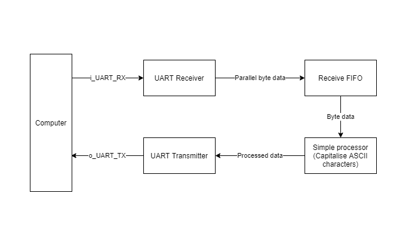

### FIFO Buffer

In our [previous tutorial](https://jeremysee2.github.io/2021/03/31/tutorial-3-uart-inteface/), our UART interface could only send and receive one byte at a time. To solve that problem, let's implement a First In First Out (FIFO) buffer to hold the previous two values in data registers. We define some specifications for our FIFO buffer below.

* 16-bit data bus
* Duplex read/write
* Read and write enable
* Full and Empty flags
* Overflow and underflow flags

We start by defining the ports to our module.

```verilog
module fifo_memory (
    input i_Clock,
    input i_Reset,
    input i_Write_En,
    input i_Read_En,
    input  [c_WIDTH:0] i_Data_In,
    output [c_WIDTH:0] o_Data_Out,
    output reg fifo_full,
    output reg fifo_empty,
    output reg fifo_overflow,
    output reg fifo_underflow
    );
endmodule
```

Then, we define the internal signals we use to store and access the memory.

```verilog
    // Internal memory, 7 16-bit wide registers
    parameter c_DEPTH = 7;
    parameter c_WIDTH = 15;
    reg [c_WIDTH:0] memory [0:c_DEPTH];
    reg [c_DEPTH:0]  wraddr = 0;
    reg [c_DEPTH:0]  rdaddr = 0;
    reg [c_WIDTH:0] r_Data_Out;
```

Then, we define logic for reading from and writing to the internal memory of the FIFO buffer, sequentially.

```verilog
    // Writing to FIFO
    always @(posedge i_Clock) begin
        if (i_Write_En) begin
            memory[wraddr] <= i_Data_In;

            // Incrementing wraddr pointer
            if ((!fifo_full) || (i_Read_En)) begin
                wraddr <= wraddr + 1'b1;
                fifo_overflow <= 1'b0;
            end
            else
                fifo_overflow <= 1'b1;
        end
    end

    // Reading from FIFO
    always @(posedge i_Clock) begin
        if (i_Read_En) begin
            r_Data_Out <= memory[rdaddr];

            // Incrementing raddr pointer
            if (!fifo_empty) begin
                rdaddr <= rdaddr + 1'b1;
                fifo_underflow <= 1'b0;
            end
            else
                fifo_underflow <= 1'b1;
        end
    end

    assign o_Data_Out = r_Data_Out;
```

Next, we want to manage the `fifo-full` and `fifo-empty` flags that we use to guide read and write operations. This section is referenced from [zipcpu](https://zipcpu.com/blog/2017/07/29/fifo.html), as it provides an efficient way to set read and write flags in one clock cycle.

```verilog

    // Calculating full/empty flags, referenced from zipcpu.com
    wire	[c_DEPTH:0]	dblnext, nxtread;
    assign	dblnext = wraddr + 2;
    assign	nxtread = rdaddr + 1'b1;

    always @(posedge i_Clock)
        if (!i_Reset)
        begin
            fifo_full <= 1'b0;
            fifo_empty <= 1'b1;
        end else casez({ i_Write_En, i_Read_En, !fifo_full, !fifo_empty })
        4'b01?1: begin	// A successful read
            fifo_full  <= 1'b0;
            fifo_empty <= (nxtread == wraddr);
        end
        4'b101?: begin	// A successful write
            fifo_full <= (dblnext == rdaddr);
            fifo_empty <= 1'b0;
        end
        4'b11?0: begin	// Successful write, failed read
            fifo_full  <= 1'b0;
            fifo_empty <= 1'b0;
        end
        4'b11?1: begin	// Successful read and write
            fifo_full  <= fifo_full;
            fifo_empty <= 1'b0;
        end
        default: begin end
        endcase
```

Lastly, we bring it all together for the final file `fifo_memory.v`.

```verilog
module fifo_memory (
    input i_Clock,
    input i_Reset,
    input i_Write_En,
    input i_Read_En,
    input  [c_WIDTH:0] i_Data_In,
    output [c_WIDTH:0] o_Data_Out,
    output reg fifo_full,
    output reg fifo_empty,
    output reg fifo_overflow,
    output reg fifo_underflow
    );

    // Internal memory, 7 16-bit wide registers
    parameter c_DEPTH = 7;
    parameter c_WIDTH = 7;
    reg [c_WIDTH:0] memory [0:c_DEPTH];
    reg [c_DEPTH:0]  wraddr = 0;
    reg [c_DEPTH:0]  rdaddr = 0;
    reg [c_WIDTH:0] r_Data_Out;

    // Writing to FIFO
    always @(posedge i_Clock) begin
        if (i_Write_En) begin
            memory[wraddr] <= i_Data_In;

            // Incrementing wraddr pointer
            if ((!fifo_full) || (i_Read_En)) begin
                wraddr <= wraddr + 1'b1;
                fifo_overflow <= 1'b0;
            end
            else
                fifo_overflow <= 1'b1;
        end
    end

    // Reading from FIFO
    always @(posedge i_Clock) begin
        if (i_Read_En) begin
            r_Data_Out <= memory[rdaddr];

            // Incrementing raddr pointer
            if (!fifo_empty) begin
                rdaddr <= rdaddr + 1'b1;
                fifo_underflow <= 1'b0;
            end
            else
                fifo_underflow <= 1'b1;
        end
    end

    assign o_Data_Out = r_Data_Out;

    // Calculating full/empty flags, referenced from zipcpu.com
    wire	[c_DEPTH:0]	dblnext, nxtread;
    assign	dblnext = wraddr + 2;
    assign	nxtread = rdaddr + 1'b1;

    always @(posedge i_Clock, negedge i_Reset)
    
        // Reset case
        if (!i_Reset)
        begin
            // Reset output flags
            fifo_full <= 1'b0;
            fifo_empty <= 1'b1;
            
        end else casez({ i_Write_En, i_Read_En, !fifo_full, !fifo_empty })
        4'b01?1: begin	// A successful read
            fifo_full  <= 1'b0;
            fifo_empty <= (nxtread == wraddr);
        end
        4'b101?: begin	// A successful write
            fifo_full <= (dblnext == rdaddr);
            fifo_empty <= 1'b0;
        end
        4'b11?0: begin	// Successful write, failed read
            fifo_full  <= 1'b0;
            fifo_empty <= 1'b0;
        end
        4'b11?1: begin	// Successful read and write
            fifo_full  <= fifo_full;
            fifo_empty <= 1'b0;
        end
        default: begin end
        endcase
    
endmodule
```

Let's write a testbench to validate the output signals of our module. By now you should be familiar with the general structure of a testbench.

1. Describe test signals
2. Instantiate unit under test (can be multiple of them)
3. Put testbench logic under `initial` block to run once. Use `always` block for repeating logic
4. Use `if` statements to validate outputs and print outputs using `$display()`
5. Save output waveform using `$dumpfile()` and `$dumpvars()`

```verilog
`timescale 1ns/1ns
`include "fifo_memory.v"

module fifo_memory_tb ();
    
    // Test signals
    reg r_Clock = 0;
    reg r_Reset = 1;
    reg r_Write_En = 0;
    reg r_Read_En = 0;
    reg  [15:0] r_Data_In = 0;
    wire [15:0] w_Data_Out;
    wire w_fifo_full;
    wire w_fifo_empty;
    wire w_fifo_overflow;
    wire w_fifo_underflow;

    parameter c_CLOCK_PERIOD_NS = 10;


    // Instantiate module
    fifo_memory #(
        .c_DEPTH(7),
        .c_WIDTH(15)
    ) UUT (
        .i_Clock(r_Clock),
        .i_Reset(r_Reset),
        .i_Write_En(r_Write_En),
        .i_Read_En(r_Read_En),
        .i_Data_In(r_Data_In),
        .o_Data_Out(w_Data_Out),
        .fifo_full(w_fifo_full),
        .fifo_empty(w_fifo_empty),
        .fifo_overflow(w_fifo_overflow),
        .fifo_underflow(w_fifo_underflow)
        );

    // Testbench logic
    always
        #(c_CLOCK_PERIOD_NS/2) r_Clock <= !r_Clock;

    // Main Testing:
    initial
    begin
        // Initialise module through reset
        r_Reset = ~r_Reset;
        #10
        r_Reset = ~r_Reset;
        #10

        // Write two bytes
        r_Data_In  <= 16'hBEEF;
        r_Write_En <= 1'b1;
        #10;
        r_Write_En <= 1'b0;
        r_Read_En  <= 1'b1;
        #10
        // Check that the correct data was received
        if (w_Data_Out == 16'hBEEF)
        $display("Test Passed - Correct two bytes received");
        else
        $display("Test Failed - Incorrect two bytes received");
        

        // Try overflowing it
        r_Write_En <= 1'b0;
        r_Read_En  <= 1'b0;

        for (integer i = 16'h0; i < 16'h1FF; i = i + 1'b1) begin
            r_Data_In  <= i;
            r_Write_En <= 1'b1;
            #10;
        end
        r_Write_En <= 1'b0;
        r_Read_En  <= 1'b0;
        if (w_fifo_overflow)
        $display("Test Passed - Overflow flag works");
        else
        $display("Test Failed - Overflow flag failed");


        // Try underflowing it
        r_Write_En <= 1'b0;
        r_Read_En  <= 1'b0;

        for (integer i = 16'h0; i < 16'h2FF; i = i + 1'b1) begin
            r_Read_En <= 1'b1;
            #10;
        end
        r_Write_En <= 1'b0;
        r_Read_En  <= 1'b0;
        if (w_fifo_underflow)
        $display("Test Passed - Underflow flag works");
        else
        $display("Test Failed - Underflow flag failed");
        $finish();
    end

    initial 
    begin
    // Required to dump signals
    $dumpfile("dump.vcd");
    $dumpvars(0);
    end

endmodule
```

Running the simulation in `iverilog` and viewing in `gtkwave` gives the following result.


Congratulations! You've defined your first FIFO buffer. In practice, FIFO buffers are very useful for the following situations.

* Crossing clock domains
* Buffering high speed, infrequent data
* Aligning data for math operations
* Buffering data coming from software, to be sent out of the chip

Now, let's use this for our UART peripheral we designed in [Tutorial 3](https://jeremysee2.github.io/2021/03/31/tutorial-3-uart-inteface/)!

#### Complete UART Transceiver

Let's draw up a block diagram of what our UART transceiver should look like.



We'll connect the RX, TX and FIFO modules that we've already created in this fashion. For some simple processing, we'll include a module that converts lower case characters to upper case characters, using a simple arithmetic operation (`-32` to convert from lower to upper case).

Let's start by designing the missing module to convert from lower to upper case. Hopefully, you've gotten the hang of Verilog from previous tutorials and are able to understand what this does!

```verilog
module lower_to_upper (
    input i_Clock,
    input i_Reset,
    input i_Data_Empty,
    input [7:0] i_data,
    output [7:0] o_data,
    output o_write_enable,
    output o_read_enable
    );

    // Internal registers
    reg r_read_enable;
    reg r_read_en_delay;

    // Shift register to delay one clock cycle
    always @(posedge i_Clock) begin
        r_read_en_delay <= o_write_enable;
        r_read_enable <= r_read_en_delay;
    end

    // Outputs
    assign o_write_enable = ~i_Data_Empty;
    assign o_read_enable = r_read_enable;
    assign o_data = i_data - 8'h20;
    
endmodule
```

Let's write a simple testbench for this module.

```verilog
`timescale 1ps/1ps
`include "lower_to_upper.v"

module lower_to_upper_tb ();

    reg r_Clock = 0;
    reg r_Reset = 1;
    reg r_Data_Empty = 1;
    reg [7:0] r_data = 8'b0;
    wire [7:0] w_data_out;
    wire w_write_enable;
    wire w_read_enable;

    parameter c_CLOCK_PERIOD_NS = 10;
    
    lower_to_upper UUT (
        .i_Clock(r_Clock),
        .i_Reset(r_Reset),
        .i_Data_Empty(r_Data_Empty),
        .i_data(r_data),
        .o_data(w_data_out),
        .o_write_enable(w_write_enable),
        .o_read_enable(w_read_enable)
    );

    always #(c_CLOCK_PERIOD_NS/2) r_Clock <= !r_Clock;

    initial begin
        r_Data_Empty <= 0;
        r_data <= 8'h61;
        #(c_CLOCK_PERIOD_NS)

        if (w_data_out == 8'h41)
            $display("Test passed");
        else
            $display("Test failed, 0x%0h",w_data_out);
        
        
        $finish();

    end

    initial 
    begin
        // Required to dump signals
        $dumpfile("dump.vcd");
        $dumpvars(0);
    end

endmodule
```

Next, let's combine everything together in a top-level module.

```verilog
`include "UART_RX.v"
`include "UART_TX.v"
`include "fifo_memory.v"
`include "lower_to_upper.v"

module UART_Transceiver (
    input i_Clock,
    input i_Reset,
    input i_RX_Serial,
    output o_TX_Serial,
    output o_TX_Done
    );
    
    // Board uses a 24 MHz clock
    // Want to interface to 115200 baud UART
    // 24000000 / 115200 = 208 Clocks Per Bit.
    parameter CLOCK_PERIOD_NS = 41;
    parameter CLKS_PER_BIT    = 208;
    parameter BIT_PERIOD      = 8600;
    parameter FIFO_DEPTH      = 7;
    parameter FIFO_WIDTH      = 7;

    // UART RX signals
    wire UART_RX_Data_Valid;
    wire [7:0] UART_RX_Byte;

    // UART_RX instance
    UART_RX #(.CLKS_PER_BIT(CLKS_PER_BIT)) UART_RX_INST
       (.i_Clock(i_Clock),
        .i_Reset(i_Reset),
        .i_RX_Serial(i_RX_Serial),
        .o_RX_Data_Valid(UART_RX_Data_Valid),
        .o_RX_Byte(UART_RX_Byte)
        );

    // FIFO signals
    wire fifo_Write_En;
    wire fifo_Read_En;
    wire [7:0] fifo_Data_In;
    wire [7:0] fifo_Data_Out;
    wire fifo_full;
    wire fifo_empty;
    wire fifo_overflow;
    wire fifo_underflow;

    assign fifo_Data_In  = UART_RX_Byte;
    assign fifo_Write_En = UART_RX_Data_Valid ? 1'b1 : 1'b0;
    assign fifo_Read_En = l2u_write_enable;


    // FIFO instance
    fifo_memory #(
        .c_DEPTH(FIFO_DEPTH),
        .c_WIDTH(FIFO_WIDTH)
    ) fifo_memory_instance (
        .i_Clock(i_Clock),
        .i_Reset(i_Reset),
        .i_Write_En(fifo_Write_En),
        .i_Read_En(fifo_Read_En),
        .i_Data_In(fifo_Data_In),
        .o_Data_Out(fifo_Data_Out),
        .fifo_full(fifo_full),
        .fifo_empty(fifo_empty),
        .fifo_overflow(fifo_overflow),
        .fifo_underflow(fifo_underflow)
        );

    // Lower to Upper signals
    wire [7:0] l2u_data_in;
    wire [7:0] l2u_data_out;
    wire l2u_write_enable;
    wire l2u_read_enable;

    assign l2u_data_in      = fifo_Data_Out;

    // Lower to Upper instance
    lower_to_upper lower_to_upper_instance(
        .i_Clock(i_Clock),
        .i_Reset(i_Reset),
        .i_Data_Empty(fifo_empty),
        .i_data(l2u_data_in),
        .o_data(l2u_data_out),
        .o_write_enable(l2u_write_enable),
        .o_read_enable(l2u_read_enable)
        );

    // UART TX signals
    wire UART_TX_DV;
    wire [7:0] UART_TX_Byte;
    wire UART_TX_Active;

    // Check if data is ready to be read from l2u
    assign UART_TX_Byte = l2u_data_out;
    assign UART_TX_DV = l2u_read_enable;

    // UART TX instance
    UART_TX #(
        .CLKS_PER_BIT(CLKS_PER_BIT)
    ) UART_TX_Inst (
        .i_Clock(i_Clock),
        .i_Reset(i_Reset),
        .i_TX_DV(UART_TX_DV),
        .i_TX_Byte(UART_TX_Byte),
        .o_TX_Active(UART_TX_Active),
        .o_TX_Serial(o_TX_Serial),
        .o_TX_Done(o_TX_Done)
        );

endmodule
```

Next, we write a testbench to send an ASCII character through UART, then receive the output through UART.

```verilog
`include "UART_Transceiver.v"
`timescale 1ps/1ps

module UART_Transceiver_tb();
    // Test signals
    reg r_Clock;
    reg r_Reset;
    reg r_RX_Serial;
    wire w_TX_Serial;
    wire w_TX_Done;

    // Testbench signals
    wire w_RX_Byte;
    reg  r_RX_Byte;
    reg [7:0] r_Task_UART_Read_DATA = 8'b0;
    reg r_Task_UART_Read_START = 1;
    reg r_Task_UART_Read_STOP = 0;

    parameter c_CLOCK_PERIOD_NS = 40; //40
    parameter c_CLKS_PER_BIT    = 208; //208
    parameter c_BIT_PERIOD      = 8600; //8600
    parameter c_FIFO_DEPTH      = 7;
    parameter c_FIFO_WIDTH      = 7;

    // Instantiate top module
    UART_Transceiver UUT (
        .i_Clock(r_Clock),
        .i_Reset(r_Reset),
        .i_RX_Serial(r_RX_Serial),
        .o_TX_Serial(w_TX_Serial),
        .o_TX_Done(w_TX_Done)
        );

    // Takes in input byte and serializes it 
    task UART_WRITE_BYTE;
    input [7:0] i_Data;
    integer     ii;
    begin
        // Send Start Bit
        r_RX_Serial <= 1'b0;
        #(c_BIT_PERIOD);
        #(c_BIT_PERIOD/8);
        
        // Send Data Byte
        for (ii=0; ii<8; ii=ii+1)
        begin
            r_RX_Serial <= i_Data[ii];
            #(c_BIT_PERIOD);
        end
        
        // Send Stop Bit
        r_RX_Serial <= 1'b1;
        #(c_BIT_PERIOD);
        end
    endtask // UART_WRITE_BYTE

    // Takes in input UART and deserializes it 
    task UART_READ_BYTE;
    integer     iii;
    begin
        // Read Start Bit
        r_Task_UART_Read_START <= w_TX_Serial;
        // #(c_BIT_PERIOD);
        #1000;
        
        // Read Data Byte
        for (iii=0; iii<8; iii=iii+1)
        begin
            r_Task_UART_Read_DATA[iii] <= w_TX_Serial;
            #(c_BIT_PERIOD);
        end
        
        // Read Stop Bit
        r_Task_UART_Read_STOP <= w_TX_Serial;
        #(c_BIT_PERIOD);
        end


    endtask // UART_READ_BYTE

    always #(c_CLOCK_PERIOD_NS/2) r_Clock <= !r_Clock;

    initial begin
        r_Task_UART_Read_START = 0;
        r_Task_UART_Read_STOP  = 0;
        r_Task_UART_Read_DATA  = 8'b0;
        r_RX_Serial = 1;
        r_Reset = 1;
        r_Clock = 0;

        // Initialise module through reset
        r_Reset = ~r_Reset;
        @(posedge r_Clock);
        r_Reset = ~r_Reset;
        @(posedge r_Clock);
        
        // Send a command to the UART (exercise Rx)
        @(posedge r_Clock);
        UART_WRITE_BYTE(8'h61); // 'a' in ASCII
        @(posedge r_Clock);
            
        // Check that the correct command was received
        @(posedge r_Clock);
        UART_READ_BYTE();
        @(posedge r_Clock);
        if (r_Task_UART_Read_DATA == 8'h41) // 'A' in ASCII
        $display("Test Passed - Correct Byte Received");
        else
        $display("Test Failed - Incorrect Byte Received, 0x%0h",r_Task_UART_Read_DATA);

        $finish();
    end

  
    initial 
    begin
        // Required to dump signals
        $dumpfile("dump.vcd");
        $dumpvars(0);
    end


endmodule
```

Running this through `gtkwave` gives the following output.


Lastly, we can implement this in hardware. We hook up a UART-USB transceiver from our computer to the FPGA board. This is similar to our testbench interaction. You can use any module for that, including the CH340, CP2102, CP2109, FT2232 etc. Use the following `io.adc` file to define your I/O pinout.

```verilog
set_pin_assignment	{ i_Reset }	{ LOCATION = K16; }
set_pin_assignment	{ i_RX_Serial }	{ LOCATION = P2; IOSTANDARD = LVCMOS33; }
set_pin_assignment	{ o_TX_Serial }	{ LOCATION = R2; IOSTANDARD = LVCMOS33; }
set_pin_assignment	{ o_TX_Done }	{ LOCATION = N5; IOSTANDARD = LVCMOS33; }

set_pin_assignment	{ i_Clock }	{ LOCATION = K14; }
```

Following the steps in Tutorial 1, we set up the environment and generate the bitstream to be uploaded to the board. Below, we can see the resource usage of the FPGA. There's still plenty of space to do whatever you want on top of this!

    ***Report Model: UART_Transceiver***
    
    IO Statistics
    #IO                     5
      #input                3
      #output               2
      #inout                0
    
    Utilization Statistics
    #lut                  194   out of  19600    0.99%
    #reg                   59   out of  19600    0.30%
    #le                   198
      #lut only           139   out of    198   70.20%
      #reg only             4   out of    198    2.02%
      #lut&reg             55   out of    198   27.78%
    #dsp                    0   out of     29    0.00%
    #bram                   1   out of     64    1.56%
      #bram9k               1
      #fifo9k               0
    #bram32k                0   out of     16    0.00%
    #pad                    5   out of    188    2.66%
      #ireg                 0
      #oreg                 2
      #treg                 0
    #pll                    0   out of      4    0.00%

Congratulations! You've implemented the beginnings of a small computer! For a graphical interface to the FPGA, check out the [next tutorial](https://jeremysee2.github.io/2021/04/01/tutorial-5-vga-display-output/) on building a VGA output.