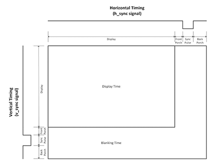

### VGA Display Output

VGA is an older display interface based on analog inputs of Red, Green and Blue for each pixel. The data for the pixels are changed by toggling `HSYNC` and `VSYNC` to indicate the active display area. The clock rate is defined by the resolution of the display output. A handy reference for VGA is available at [Digikey](https://www.digikey.sg/eewiki/pages/viewpage.action?pageId=15925278). This tutorial is based on information from that blog post, as well as the [relevant Nandland tutorial](https://www.youtube.com/watch?v=7wjTJivsNMM).



| Resolution | Refresh Rate | Pixel Clock (MHz) | Display (H) | Inactive Area (H) | Display (V) | Inactive Area (V) |
| --- | --- | --- | --- | --- | --- | --- |
| 640x480 | 60 | 25.175 | 640 | 160 | 480 | 120 |

From this, we know that we need to manage the VSYNC and HSYNC signals to control when we output RGB pixel data. Let's start by creating a module that generates the appropriate VSYNC and HSYNC signals, given a certain fixed resolution. Create the following file `VGA_Sync_Pulses`.

```verilog
// This module is designed for 640x480 with a 25 MHz input clock.

module VGA_Sync_Pulses 
 #(parameter TOTAL_COLS  = 800, 
   parameter TOTAL_ROWS  = 525,
   parameter ACTIVE_COLS = 640, 
   parameter ACTIVE_ROWS = 480)
  (input             i_Clk, 
   output            o_HSync,
   output            o_VSync,
   output reg [11:0] o_Col_Count = 0, 
   output reg [11:0] o_Row_Count = 0
  );  
  
  always @(posedge i_Clk)
  begin
    if (o_Col_Count == TOTAL_COLS-1)
    begin
      o_Col_Count <= 0;
      if (o_Row_Count == TOTAL_ROWS-1)
        o_Row_Count <= 0;
      else
        o_Row_Count <= o_Row_Count + 1;
    end
    else
      o_Col_Count <= o_Col_Count + 1;
      
  end
	
  // Only high in the ACTIVE AREA of the display
  assign o_HSync = o_Col_Count < ACTIVE_COLS ? 1'b1 : 1'b0;
  assign o_VSync = o_Row_Count < ACTIVE_ROWS ? 1'b1 : 1'b0;
  
endmodule
```

The `always` block keeps track of the current pixel being described by the entire VGA module. This can be used from other modules to map graphics onto correct parts of the screen. The last blocks drive the HSYNC and VSYNC signals high when in the active area of the screen.

Next, let's feed these signals into a test pattern generator (from [Nandland](https://www.youtube.com/watch?v=7wjTJivsNMM)). This module takes in the HSYNC and VSYNC signals and a pattern selector to generate the appropriate HSYNC, VSYNC and RGB signals.

```verilog
// This module is designed for 640x480 with a 25 MHz input clock.
// All test patterns are being generated all the time.  This makes use of one
// of the benefits of FPGAs, they are highly parallelizable.  Many different
// things can all be happening at the same time.  In this case, there are several
// test patterns that are being generated simulatenously.  The actual choice of
// which test pattern gets displayed is done via the i_Pattern signal, which is
// an input to a case statement.

// Available Patterns:
// Pattern 0: Disables the Test Pattern Generator
// Pattern 1: All Red
// Pattern 2: All Green
// Pattern 3: All Blue
// Pattern 4: Checkerboard white/black
// Pattern 5: Color Bars
// Pattern 6: White Box with Border (2 pixels)

// Note: Comment out this line when building in iCEcube2:
`include "Sync_To_Count.v"


module Test_Pattern_Gen 
  #(parameter VIDEO_WIDTH = 3,
   parameter TOTAL_COLS  = 800,
   parameter TOTAL_ROWS  = 525,
   parameter ACTIVE_COLS = 640,
   parameter ACTIVE_ROWS = 480)
  (input       i_Clk,
   input [3:0] i_Pattern,
   input       i_HSync,
   input       i_VSync,
   output reg  o_HSync = 0,
   output reg  o_VSync = 0,
   output reg [VIDEO_WIDTH-1:0] o_Red_Video,
   output reg [VIDEO_WIDTH-1:0] o_Grn_Video,
   output reg [VIDEO_WIDTH-1:0] o_Blu_Video);
  
  wire w_VSync;
  wire w_HSync;
  
  
  // Patterns have 16 indexes (0 to 15) and can be g_Video_Width bits wide
  wire [VIDEO_WIDTH-1:0] Pattern_Red[0:15];
  wire [VIDEO_WIDTH-1:0] Pattern_Grn[0:15];
  wire [VIDEO_WIDTH-1:0] Pattern_Blu[0:15];
  
  // Make these unsigned counters (always positive)
  wire [9:0] w_Col_Count;
  wire [9:0] w_Row_Count;

  wire [6:0] w_Bar_Width;
  wire [2:0] w_Bar_Select;
  
  Sync_To_Count #(.TOTAL_COLS(TOTAL_COLS),
                  .TOTAL_ROWS(TOTAL_ROWS))
  
  UUT (.i_Clk      (i_Clk),
       .i_HSync    (i_HSync),
       .i_VSync    (i_VSync),
       .o_HSync    (w_HSync),
       .o_VSync    (w_VSync),
       .o_Col_Count(w_Col_Count),
       .o_Row_Count(w_Row_Count)
      );
	  
  
  // Register syncs to align with output data.
  always @(posedge i_Clk)
  begin
    o_VSync <= w_VSync;
    o_HSync <= w_HSync;
  end
  
  /////////////////////////////////////////////////////////////////////////////
  // Pattern 0: Disables the Test Pattern Generator
  /////////////////////////////////////////////////////////////////////////////
  assign Pattern_Red[0] = 0;
  assign Pattern_Grn[0] = 0;
  assign Pattern_Blu[0] = 0;
  
  /////////////////////////////////////////////////////////////////////////////
  // Pattern 1: All Red
  /////////////////////////////////////////////////////////////////////////////
  assign Pattern_Red[1] = (w_Col_Count < ACTIVE_COLS && w_Row_Count < ACTIVE_ROWS) ? {VIDEO_WIDTH{1'b1}} : 0;
  assign Pattern_Grn[1] = 0;
  assign Pattern_Blu[1] = 0;

  /////////////////////////////////////////////////////////////////////////////
  // Pattern 2: All Green
  /////////////////////////////////////////////////////////////////////////////
  assign Pattern_Red[2] = 0;
  assign Pattern_Grn[2] = (w_Col_Count < ACTIVE_COLS && w_Row_Count < ACTIVE_ROWS) ? {VIDEO_WIDTH{1'b1}} : 0;
  assign Pattern_Blu[2] = 0;
  
  /////////////////////////////////////////////////////////////////////////////
  // Pattern 3: All Blue
  /////////////////////////////////////////////////////////////////////////////
  assign Pattern_Red[3] = 0;
  assign Pattern_Grn[3] = 0;
  assign Pattern_Blu[3] = (w_Col_Count < ACTIVE_COLS && w_Row_Count < ACTIVE_ROWS) ? {VIDEO_WIDTH{1'b1}} : 0;

  /////////////////////////////////////////////////////////////////////////////
  // Pattern 4: Checkerboard white/black
  /////////////////////////////////////////////////////////////////////////////
  assign Pattern_Red[4] = w_Col_Count[5] ^ w_Row_Count[5] ? {VIDEO_WIDTH{1'b1}} : 0;
  assign Pattern_Grn[4] = Pattern_Red[4];
  assign Pattern_Blu[4] = Pattern_Red[4];
  
  
  /////////////////////////////////////////////////////////////////////////////
  // Pattern 5: Color Bars
  // Divides active area into 8 Equal Bars and colors them accordingly
  // Colors Each According to this Truth Table:
  // R G B  w_Bar_Select  Ouput Color
  // 0 0 0       0        Black
  // 0 0 1       1        Blue
  // 0 1 0       2        Green
  // 0 1 1       3        Turquoise
  // 1 0 0       4        Red
  // 1 0 1       5        Purple
  // 1 1 0       6        Yellow
  // 1 1 1       7        White
  /////////////////////////////////////////////////////////////////////////////
  assign w_Bar_Width = ACTIVE_COLS/8;
  
  assign w_Bar_Select = w_Col_Count < w_Bar_Width*1 ? 0 : 
                        w_Col_Count < w_Bar_Width*2 ? 1 :
				        w_Col_Count < w_Bar_Width*3 ? 2 :
				        w_Col_Count < w_Bar_Width*4 ? 3 :
				        w_Col_Count < w_Bar_Width*5 ? 4 :
				        w_Col_Count < w_Bar_Width*6 ? 5 :
				        w_Col_Count < w_Bar_Width*7 ? 6 : 7;
				  
  // Implement Truth Table above with Conditional Assignments
  assign Pattern_Red[5] = (w_Bar_Select == 4 || w_Bar_Select == 5 ||
                           w_Bar_Select == 6 || w_Bar_Select == 7) ? 
                          {VIDEO_WIDTH{1'b1}} : 0;
					 
  assign Pattern_Grn[5] = (w_Bar_Select == 2 || w_Bar_Select == 3 ||
                           w_Bar_Select == 6 || w_Bar_Select == 7) ? 
                          {VIDEO_WIDTH{1'b1}} : 0;
					 					 
  assign Pattern_Blu[5] = (w_Bar_Select == 1 || w_Bar_Select == 3 ||
                           w_Bar_Select == 5 || w_Bar_Select == 7) ?
                          {VIDEO_WIDTH{1'b1}} : 0;


  /////////////////////////////////////////////////////////////////////////////
  // Pattern 6: Black With White Border
  // Creates a black screen with a white border 2 pixels wide around outside.
  /////////////////////////////////////////////////////////////////////////////
  assign Pattern_Red[6] = (w_Row_Count <= 1 || w_Row_Count >= ACTIVE_ROWS-1-1 ||
                           w_Col_Count <= 1 || w_Col_Count >= ACTIVE_COLS-1-1) ?
                          {VIDEO_WIDTH{1'b1}} : 0;
  assign Pattern_Grn[6] = Pattern_Red[6];
  assign Pattern_Blu[6] = Pattern_Red[6];
  

  /////////////////////////////////////////////////////////////////////////////
  // Select between different test patterns
  /////////////////////////////////////////////////////////////////////////////
  always @(posedge i_Clk)
  begin
    case (i_Pattern)
      4'h0 : 
      begin
	    o_Red_Video <= Pattern_Red[0];
        o_Grn_Video <= Pattern_Grn[0];
        o_Blu_Video <= Pattern_Blu[0];
      end
      4'h1 :
      begin
        o_Red_Video <= Pattern_Red[1];
        o_Grn_Video <= Pattern_Grn[1];
        o_Blu_Video <= Pattern_Blu[1];
      end
      4'h2 :
      begin
        o_Red_Video <= Pattern_Red[2];
        o_Grn_Video <= Pattern_Grn[2];
        o_Blu_Video <= Pattern_Blu[2];
      end
      4'h3 :
      begin
        o_Red_Video <= Pattern_Red[3];
        o_Grn_Video <= Pattern_Grn[3];
        o_Blu_Video <= Pattern_Blu[3];
      end
      4'h4 :
      begin
        o_Red_Video <= Pattern_Red[4];
        o_Grn_Video <= Pattern_Grn[4];
        o_Blu_Video <= Pattern_Blu[4];
      end
      4'h5 :
      begin
        o_Red_Video <= Pattern_Red[5];
        o_Grn_Video <= Pattern_Grn[5];
        o_Blu_Video <= Pattern_Blu[5];
      end
      4'h6 :
      begin
        o_Red_Video <= Pattern_Red[6];
        o_Grn_Video <= Pattern_Grn[6];
        o_Blu_Video <= Pattern_Blu[6];
      end
      default:
      begin
        o_Red_Video <= Pattern_Red[0];
        o_Grn_Video <= Pattern_Grn[0];
        o_Blu_Video <= Pattern_Blu[0];
      end
    endcase
  end
endmodule
```

```verilog
// This module will take incoming horizontal and veritcal sync pulses and
// create Row and Column counters based on these syncs.
// It will align the Row/Col counters to the output Sync pulses.
// Useful for any module that needs to keep track of which Row/Col position we
// are on in the middle of a frame
module Sync_To_Count 
 #(parameter TOTAL_COLS = 800,
   parameter TOTAL_ROWS = 525)
  (input            i_Clk,
   input            i_HSync,
   input            i_VSync, 
   output reg       o_HSync = 0,
   output reg       o_VSync = 0,
   output reg [9:0] o_Col_Count = 0,
   output reg [9:0] o_Row_Count = 0);
   
   wire w_Frame_Start;
   
  // Register syncs to align with output data.
  always @(posedge i_Clk)
  begin
    o_VSync <= i_VSync;
    o_HSync <= i_HSync;
  end

  // Keep track of Row/Column counters.
  always @(posedge i_Clk)
  begin
    if (w_Frame_Start == 1'b1)
    begin
      o_Col_Count <= 0;
      o_Row_Count <= 0;
    end
    else
    begin
      if (o_Col_Count == TOTAL_COLS-1)
      begin
        if (o_Row_Count == TOTAL_ROWS-1)
        begin
          o_Row_Count <= 0;
        end
        else
        begin
          o_Row_Count <= o_Row_Count + 1;
        end
        o_Col_Count <= 0;
      end
      else
      begin
        o_Col_Count <= o_Col_Count + 1;
      end
    end
  end
  
    
  // Look for rising edge on Vertical Sync to reset the counters
  assign w_Frame_Start = (~o_VSync & i_VSync);

endmodule
```

The test pattern generator chooses from a preset list of output patterns to drive the HSYNC, VSYNC and RGB lines. Additionally, the `Sync_To_Count` keeps track of the current pixel position in terms of Columns and Rows, an identical function to that in the `VGA_Sync_Pulses` module, as we didn't use the outputs from that module. This was done just for convenience sake of keeping the `Test_Pattern_Generator` self-contained.

Lastly, we add the `VGA_Sync_Porch` module to add the inactive area to the output from the test pattern generator. Effectively, this modifies the HSYNC and VSYNC signals when in the inactive area to include the front porch and back porch, where they should be driven high.

```verilog
// The purpose of this module is to modify the input HSync and VSync signals to
// include some time for what is called the Front and Back porch.  The front
// and back porch of a VGA interface used to have more meaning when a monitor
// actually used a Cathode Ray Tube (CRT) to draw an image on the screen.  You
// can read more about the details of how old VGA monitors worked.  These
// days, the notion of a front and back porch is maintained, due more to
// convention than to the physics of the monitor.
// New standards like DVI and HDMI which are meant for digital signals have
// removed this notion of the front and back porches.  Remember that VGA is an
// analog interface.
// This module is designed for 640x480 with a 25 MHz input clock.

module VGA_Sync_Porch #(parameter VIDEO_WIDTH = 3,  // remember to 
                        parameter TOTAL_COLS  = 3,  // overwrite
                        parameter TOTAL_ROWS  = 3,  // these defaults
                        parameter ACTIVE_COLS = 2,
                        parameter ACTIVE_ROWS = 2)
  (input i_Clk,
   input i_HSync,
   input i_VSync,
   input [VIDEO_WIDTH-1:0] i_Red_Video,
   input [VIDEO_WIDTH-1:0] i_Grn_Video,
   input [VIDEO_WIDTH-1:0] i_Blu_Video,
   output reg o_HSync,
   output reg o_VSync,
   output reg [VIDEO_WIDTH-1:0] o_Red_Video,
   output reg [VIDEO_WIDTH-1:0] o_Grn_Video,
   output reg [VIDEO_WIDTH-1:0] o_Blu_Video
   );

  parameter c_FRONT_PORCH_HORZ = 18;
  parameter c_BACK_PORCH_HORZ  = 50;
  parameter c_FRONT_PORCH_VERT = 10;
  parameter c_BACK_PORCH_VERT  = 33;

  wire w_HSync;
  wire w_VSync;
  
  wire [9:0] w_Col_Count;
  wire [9:0] w_Row_Count;
  
  reg [VIDEO_WIDTH-1:0] r_Red_Video = 0;
  reg [VIDEO_WIDTH-1:0] r_Grn_Video = 0;
  reg [VIDEO_WIDTH-1:0] r_Blu_Video = 0;
  
  Sync_To_Count #(.TOTAL_COLS(TOTAL_COLS),
                  .TOTAL_ROWS(TOTAL_ROWS)) UUT 
  (.i_Clk      (i_Clk),
   .i_HSync    (i_HSync),
   .i_VSync    (i_VSync),
   .o_HSync    (w_HSync),
   .o_VSync    (w_VSync),
   .o_Col_Count(w_Col_Count),
   .o_Row_Count(w_Row_Count)
  );
	  
  // Purpose: Modifies the HSync and VSync signals to include Front/Back Porch
  always @(posedge i_Clk)
  begin
    if ((w_Col_Count < c_FRONT_PORCH_HORZ + ACTIVE_COLS) || 
        (w_Col_Count > TOTAL_COLS - c_BACK_PORCH_HORZ - 1))
      o_HSync <= 1'b1;
    else
      o_HSync <= w_HSync;
    
    if ((w_Row_Count < c_FRONT_PORCH_VERT + ACTIVE_ROWS) ||
        (w_Row_Count > TOTAL_ROWS - c_BACK_PORCH_VERT - 1))
      o_VSync <= 1'b1;
    else
      o_VSync <= w_VSync;
  end

  
  // Purpose: Align input video to modified Sync pulses.
  // Adds in 2 Clock Cycles of Delay
  always @(posedge i_Clk)
  begin
    r_Red_Video <= i_Red_Video;
    r_Grn_Video <= i_Grn_Video;
    r_Blu_Video <= i_Blu_Video;

    o_Red_Video <= r_Red_Video;
    o_Grn_Video <= r_Grn_Video;
    o_Blu_Video <= r_Blu_Video;
  end
  
endmodule
```

Lastly, we combine all of the above modules into a top level file called `vga_top.v`.

```verilog
module vga_top
#(
	parameter c_TOTAL_COLS 			= 800,
	parameter c_TOTAL_ROWS    		= 525,
	parameter c_ACTIVE_COLS			= 640,
	parameter c_ACTIVE_ROWS 		= 480,
	parameter c_VIDEO_WIDTH 		= 3 // 3 bits per pixel
)

( 
	// 24MHz clock on board
	input wire clk,
	input wire rst,
	
	
	// VGA Connections
	output wire [c_VIDEO_WIDTH-1:0] R,
	output wire [c_VIDEO_WIDTH-1:0] G,
	output wire [c_VIDEO_WIDTH-1:0] B,
	output wire o_VGA_HSync,
	output wire o_VGA_VSync
);

	// Internal R,G,B wires: VGA Signals
	wire [c_VIDEO_WIDTH-1:0] w_Red_Video_TP, w_Red_Video_Porch;
	wire [c_VIDEO_WIDTH-1:0] w_Grn_Video_TP, w_Grn_Video_Porch;
	wire [c_VIDEO_WIDTH-1:0] w_Blu_Video_TP, w_Blu_Video_Porch;
	
	// VGA_Sync_Pulses to generate HSYNC and VSYNC
	VGA_Sync_Pulses   #(  
		.TOTAL_COLS  (c_TOTAL_COLS), 
   		.TOTAL_ROWS  (c_TOTAL_ROWS),
   		.ACTIVE_COLS (c_ACTIVE_COLS), 
   		.ACTIVE_ROWS (c_ACTIVE_ROWS)
	) VGA_Sync_Pulses_Inst (
		.i_Clk (clk),
   		.o_HSync (w_HSync_Start),
   		.o_VSync (w_VSync_Start),
   		.o_Col_Count (), 
   		.o_Row_Count ()
  	);
  	
  	// Test pattern to generate R,G,B signals
	Test_Pattern_Gen  #(
		.VIDEO_WIDTH(c_VIDEO_WIDTH),
		.TOTAL_COLS(c_TOTAL_COLS),
		.TOTAL_ROWS(c_TOTAL_ROWS),
		.ACTIVE_COLS(c_ACTIVE_COLS),
		.ACTIVE_ROWS(c_ACTIVE_ROWS))
	Test_Pattern_Gen_Inst(
		.i_Clk(clk),
		.i_Pattern(4'h1), // color bars
		.i_HSync(w_HSync_Start),
		.i_VSync(w_VSync_Start),
		.o_HSync(w_HSync_TP),
		.o_VSync(w_VSync_TP),
		.o_Red_Video(w_Red_Video_TP),
		.o_Grn_Video(w_Grn_Video_TP),
		.o_Blu_Video(w_Blu_Video_TP));

	// Add inactive area to output HSYNC, VSYNC from test pattern
	VGA_Sync_Porch  #(
		.VIDEO_WIDTH(c_VIDEO_WIDTH),
		.TOTAL_COLS(c_TOTAL_COLS),
		.TOTAL_ROWS(c_TOTAL_ROWS),
		.ACTIVE_COLS(c_ACTIVE_COLS),
		.ACTIVE_ROWS(c_ACTIVE_ROWS))
	VGA_Sync_Porch_Inst(
		.i_Clk(clk),
		.i_HSync(w_HSync_TP),
		.i_VSync(w_VSync_TP),
		.i_Red_Video(w_Red_Video_TP),
		.i_Grn_Video(w_Grn_Video_TP),
		.i_Blu_Video(w_Blu_Video_TP),
		.o_HSync(w_HSync_Porch),
		.o_VSync(w_VSync_Porch),
		.o_Red_Video(w_Red_Video_Porch),
		.o_Grn_Video(w_Grn_Video_Porch),
		.o_Blu_Video(w_Blu_Video_Porch));

	// Send final signals to output pins
	assign o_VGA_HSync = w_HSync_Porch;
	assign o_VGA_VSync = w_VSync_Porch;
	
	assign R = w_Red_Video_Porch;
	assign G = w_Grn_Video_Porch;
	assign B = w_Blu_Video_Porch;

endmodule
```

In this module, we set the resolution parameters for the modules and use the defaults for the front porch, back porch and sync pulse in the inactive area. Then, we define the wires connecting the modules together, and to external components such as the onboard 24 MHz clock, the reset button (active low) and the VGA connector. The 24 MHz clock isn't optimal as a 25.175MHz clock is specified. However, it's good enough for our learning purposes. Optionally, you can use the PLL IP module to generate the correct clock, but it varies from vendor to vendor and its code isn't transferrable across vendors.

In my case, I use the [VGA PS2 board from Waveshare](https://github.com/jeremysee2/Lichee-Tang-Tutorial/raw/master/tutorial-5/VGA-PS2-Board-Schematic.pdf), which uses an R2R DAC to generate 3-bit RGB colour. 3V3 logic levels on the FPGA result in a maximum 0.7V analog voltage to the VGA connector, the maximum value for each colour.

With this, congratulations! You've made your first video output with VGA and are on track to do great things with FPGAs! By now you should be sufficiently well versed in Verilog and are able to understand how HDL code is designed and executed. I recommend trying out [Nandland's Pong walkthrough](https://www.youtube.com/watch?v=sFgNpK4yQwQ) or running the [PicoRV32 core on this FPGA](https://github.com/nekomona/picorv32-tang) as a stretcher exercise. The possibilities are endless!