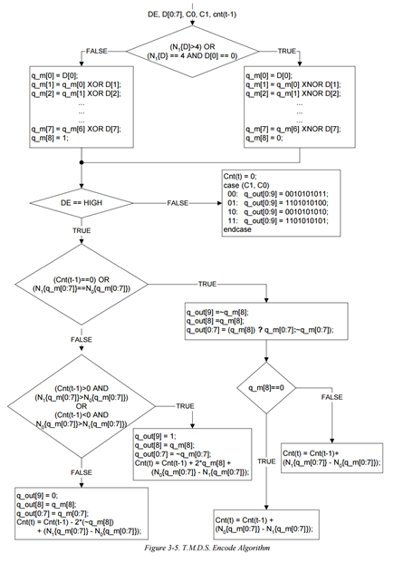
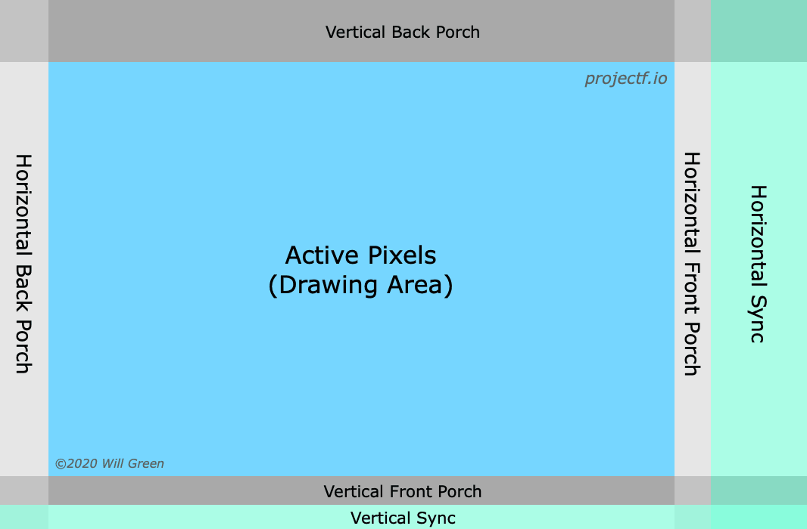
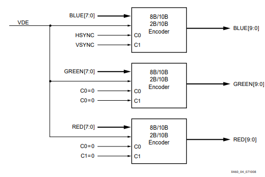
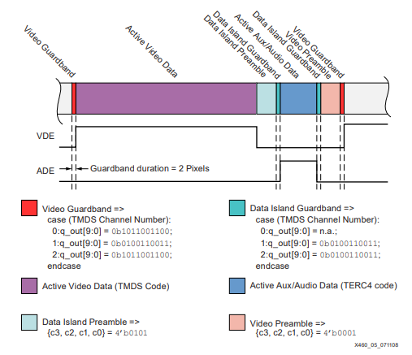
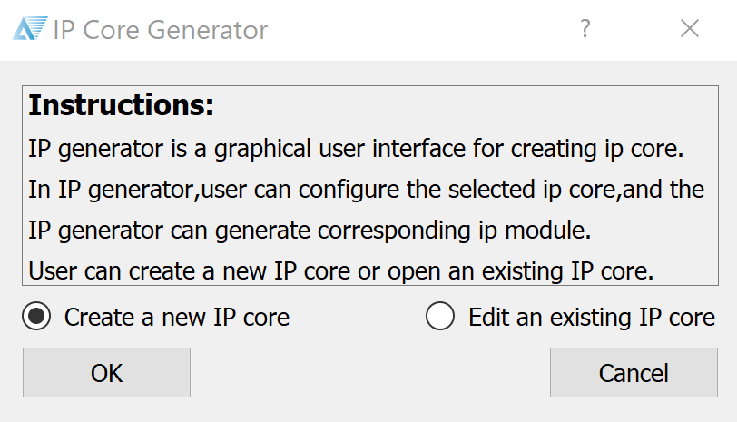
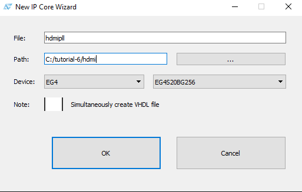
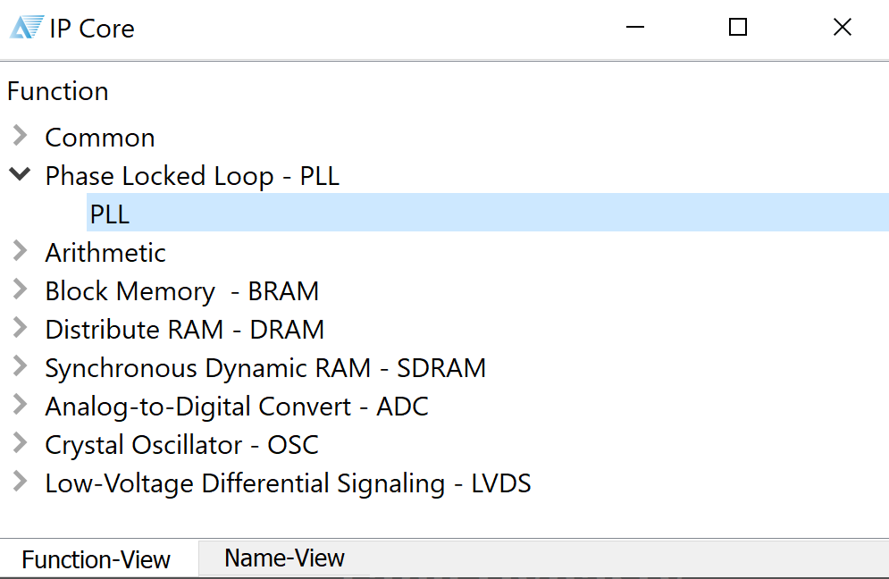
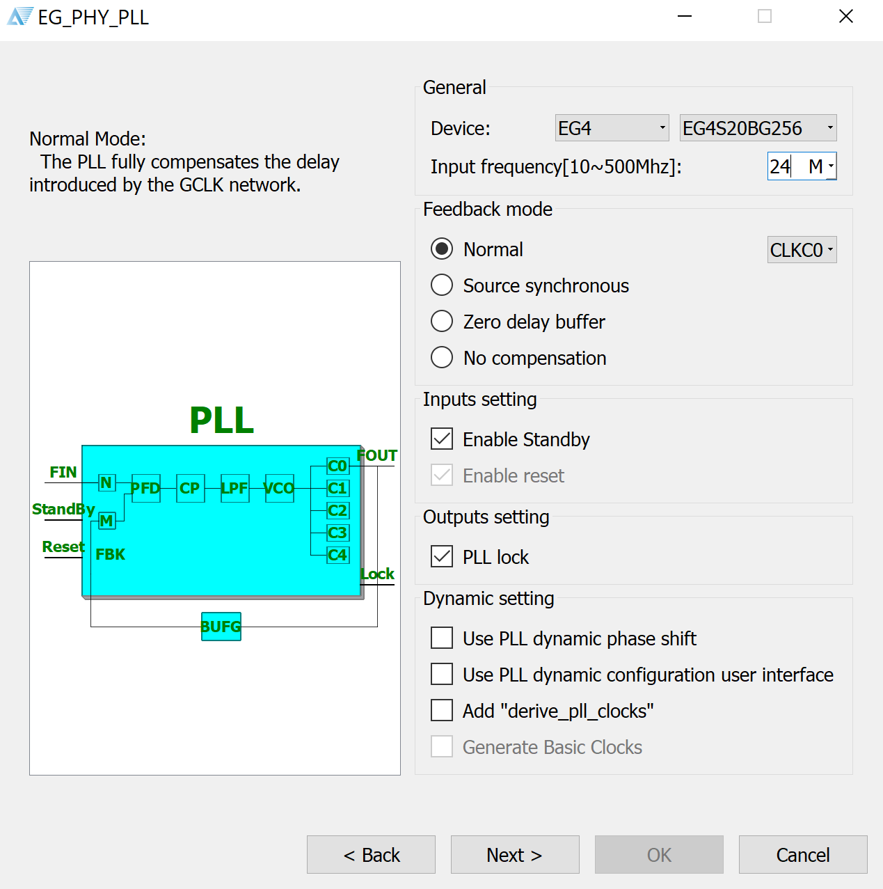
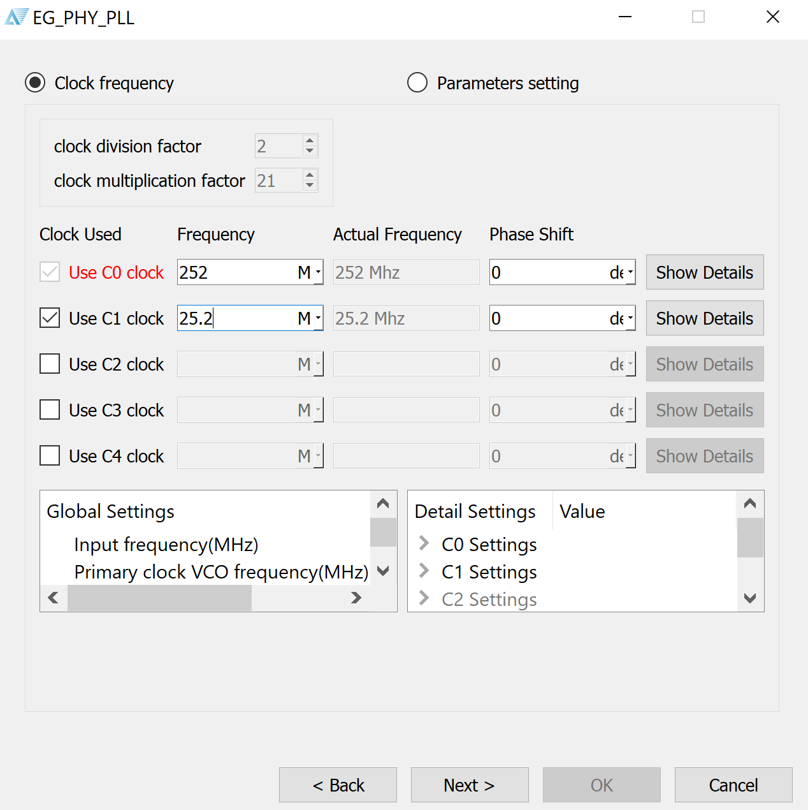

### DVI/HDMI Display Output

In the previous tutorial, we covered the VGA display interface. It converts parallel RGB data into the analog VGA interface. Now, let's take a look at a modern video data protocol, HDMI.

HDMI is based on the DVI standard before it, which comprises several signals that carry both device description data, audio data and video data. Due to licensing issues, we will be implementing the older (and simpler) DVI standard, which does not include audio. Device data travels via I2C or CEC. Video data travels on the Transition Minimised Differential Signalling (TMDS) physical layer.

#### TMDS Signalling

This signalling standard encodes 8 bits of each colour (RGB) into 10 bits. The information is then transmitted at 10x the speed of the pixel clock. This format is called `8b/10b`.



TMDS comprises two different encoding schemes depending on whether pixel data or control data is being transmitted. This is similar to VGA, where we send control signals (HSYNC, VSYNC) in the blanking area of each frame. The pixel clock specification is calculated on the colour bit depth and resolution (how much data you need to send). As a general rule of thumb, this hasn't changed since our last encounter with VGA, except now your TMDS clock will be 10x the speed of your base pixel clock.



##### Control Tokens

There are 4 10-bit control tokens used to transmit two bits of data. These are mapped to the HSYNC and VSYNC video signals, similar to VGA, and for synchronisation purposes. This is done in the blanking period. `c0` and `c1` represent the HSYNC and VSYNC signals respectively.



The tokens are:

| c0 | c1 | bits |
| --- | --- | --- |
| 0 | 0 | 10'b0010101011 |
| 0 | 1 | 10'b0010101010 |
| 1 | 0 | 10'b1101010100 |
| 1 | 1 | 10'b1101010101 |

##### Data Island (HDMI Only)

Additionally, HDMI defines a Data Island to transmit audio data and auxiliary data. This includes InfoFrames and other descriptive data, making it the key difference between the two protocols. This uses another encoding scheme called `TERC4` which allows 4 bits of data per channel to be sent.



```verilog
case (D3, D2, D1, D0):
    0000: q_out[9:0] = 0b1010011100;
    0001: q_out[9:0] = 0b1001100011;
    0010: q_out[9:0] = 0b1011100100;
    0011: q_out[9:0] = 0b1011100010;
    0100: q_out[9:0] = 0b0101110001;
    0101: q_out[9:0] = 0b0100011110;
    0110: q_out[9:0] = 0b0110001110;
    0111: q_out[9:0] = 0b0100111100;
    1000: q_out[9:0] = 0b1011001100;
    1001: q_out[9:0] = 0b0100111001;
    1010: q_out[9:0] = 0b0110011100;
    1011: q_out[9:0] = 0b1011000110;
    1100: q_out[9:0] = 0b1010001110;
    1101: q_out[9:0] = 0b1001110001;
    1110: q_out[9:0] = 0b0101100011;
    1111: q_out[9:0] = 0b1011000011;
endcase;
```

##### Pixel Data Encoding

To reduce the number of transitions in the data byte, TMDS uses `XOR` or `XNOR` encoding. Each bit is the XOR/XNOR of itself with the encoded version of the previous bit.

* Fewer than 4 ones, use `XOR`
* More than 4 ones, use `XNOR`
* Exactly 4 ones, start with 1 use `XOR`, start with 0 use `XNOR`

Add a 9th bit to describe the encoding method used, "1" for `XOR` and "0" for `XNOR`. This is likely [the reason](https://docs.google.com/document/d/1v7AJK4cVG3uDJo_rn0X9vxMvBwXKBSL1VaJgiXgFo5A) why a pixel clock is provided in DVI/HDMI, as opposed to VGA where the clock is recovered from the video data.

##### Maintaining DC Bias

The output of this encoding doesn't guarantee an even number of ones and zeros, to create a net amplitude of zero. TMDS may invert a symbol and adds another bit to determine if the 10-bit symbol was inverted. This consists of the 8-bit data and 1-bit encoding, 1-bit inverted symbol.

### Verilog Implementation

This code is derived from [fpga4fun's post](https://www.fpga4fun.com/HDMI.html) on HDMI.

We start by implementing the TMDS encoder for DVI, as mentioned above. To start off, we define the inputs/outputs to the module.

```verilog
module TMDS_encoder(
	input clk,
	input [7:0] VD,  // video data (red, green or blue)
	input [1:0] CD,  // control data
	input VDE,  // video data enable, to choose between CD (when VDE=0) and VD (when VDE=1)
	output reg [9:0] TMDS = 0
    );
endmodule
```

Next, we implement `XNOR` encoding the reduce the number of transitions in the data byte.

```verilog
wire [3:0] Nb1s = VD[0] + VD[1] + VD[2] + VD[3] + VD[4] + VD[5] + VD[6] + VD[7];
wire XNOR = (Nb1s>4'd4) || (Nb1s==4'd4 && VD[0]==1'b0);
wire [8:0] q_m = {~XNOR, q_m[6:0] ^ VD[7:1] ^ {7{XNOR}}, VD[0]};
```

Then, we implement the code to generate the inverting bit, and invert the signal if necessary, for DC biasing.

```verilog
reg [3:0] balance_acc = 0;
wire [3:0] balance = q_m[0] + q_m[1] + q_m[2] + q_m[3] + q_m[4] + q_m[5] + q_m[6] + q_m[7] - 4'd4;
wire balance_sign_eq = (balance[3] == balance_acc[3]);
wire invert_q_m = (balance==0 || balance_acc==0) ? ~q_m[8] : balance_sign_eq;
wire [3:0] balance_acc_inc = balance - ({q_m[8] ^ ~balance_sign_eq} & ~(balance==0 || balance_acc==0));
wire [3:0] balance_acc_new = invert_q_m ? balance_acc-balance_acc_inc : balance_acc+balance_acc_inc;
wire [9:0] TMDS_data = {invert_q_m, q_m[8], q_m[7:0] ^ {8{invert_q_m}}};
wire [9:0] TMDS_code = CD[1] ? (CD[0] ? 10'b1010101011 : 10'b0101010100) : (CD[0] ? 10'b0010101011 : 10'b1101010100);
```

Below is the full `TMDS_encoder` module.

```verilog
module TMDS_encoder(
	input clk,
	input [7:0] VD,  // video data (red, green or blue)
	input [1:0] CD,  // control data
	input VDE,  // video data enable, to choose between CD (when VDE=0) and VD (when VDE=1)
	output reg [9:0] TMDS = 0
    );

    wire [3:0] Nb1s = VD[0] + VD[1] + VD[2] + VD[3] + VD[4] + VD[5] + VD[6] + VD[7];
    wire XNOR = (Nb1s>4'd4) || (Nb1s==4'd4 && VD[0]==1'b0);
    wire [8:0] q_m = {~XNOR, q_m[6:0] ^ VD[7:1] ^ {7{XNOR}}, VD[0]};

    reg [3:0] balance_acc = 0;
    wire [3:0] balance = q_m[0] + q_m[1] + q_m[2] + q_m[3] + q_m[4] + q_m[5] + q_m[6] + q_m[7] - 4'd4;
    wire balance_sign_eq = (balance[3] == balance_acc[3]);
    wire invert_q_m = (balance==0 || balance_acc==0) ? ~q_m[8] : balance_sign_eq;
    wire [3:0] balance_acc_inc = balance - ({q_m[8] ^ ~balance_sign_eq} & ~(balance==0 || balance_acc==0));
    wire [3:0] balance_acc_new = invert_q_m ? balance_acc-balance_acc_inc : balance_acc+balance_acc_inc;
    wire [9:0] TMDS_data = {invert_q_m, q_m[8], q_m[7:0] ^ {8{invert_q_m}}};
    wire [9:0] TMDS_code = CD[1] ? (CD[0] ? 10'b1010101011 : 10'b0101010100) : (CD[0] ? 10'b0010101011 : 10'b1101010100);

    always @(posedge clk) TMDS <= VDE ? TMDS_data : TMDS_code;
    always @(posedge clk) balance_acc <= VDE ? balance_acc_new : 4'h0;
endmodule
```

Next, we implement a simple top-level module with a test pattern generator. In this case, we use a 25MHz clock for the TMDS clock, and a 250MHz clock for the 10-bit data. To generate this clock frequency, we use a Phase Locked Loop (PLL) IP block. This allows us to use the PLL peripheral in the FPGA, which varies from vendor to vendor. Using the Tang Dynasty IDE, we can use the Tools > IP generator.



Select "Create a new IP core".



Name your module, and make sure the correct device is selected for the Tang.



Select the Phase Locked Loop (PLL) function.



Key in the input frequency of the external oscillator on the Tang, 24MHz.



Then, choose your desired output frequencies. For simplicity, we choose 252MHz and 25.2MHz, which is close enough to our desired frequencies of 25MHz pixel clock and 250MHz data frequency. We instantiate the PLL module as follows:

```verilog
    pllhdmi pllInstance(.refclk(clk),
                    .reset(~rst),
                    .stdby(),
                    .extlock(),
                    .clk0_out(clk_TMDS),
                    .clk1_out(pixclk));
```

Below is the full `HDMI_test` top level module. This includes a simple test pattern generator from [fpga4fun](https://www.fpga4fun.com/HDMI.html).

```verilog
module HDMI_test(
	input clk,  // 24MHz
	input rst,
	output [2:0] TMDSp,
	output TMDSp_clock,
	output pixclk,
	output HDMI_HPD
    );

    ////////////////////////////////////////////////////////////////////////
    wire clk_TMDS;
    assign HDMI_HPD = 1'b1;

    pllhdmi pllInstance(.refclk(clk),
                    .reset(~rst),
                    .stdby(),
                    .extlock(),
                    .clk0_out(clk_TMDS),
                    .clk1_out(pixclk));


    ////////////////////////////////////////////////////////////////////////
    reg [9:0] CounterX, CounterY;
    reg hSync, vSync, DrawArea;
    always @(posedge pixclk) DrawArea <= (CounterX<640) && (CounterY<480);

    always @(posedge pixclk) CounterX <= (CounterX==799) ? 0 : CounterX+1;
    always @(posedge pixclk) if(CounterX==799) CounterY <= (CounterY==524) ? 0 : CounterY+1;

    always @(posedge pixclk) hSync <= (CounterX>=656) && (CounterX<752);
    always @(posedge pixclk) vSync <= (CounterY>=490) && (CounterY<492);

    ////////////////////////////////////////////////////////////////////////
    wire [7:0] W = {8{CounterX[7:0]==CounterY[7:0]}};
    wire [7:0] A = {8{CounterX[7:5]==3'h2 && CounterY[7:5]==3'h2}};
    reg [7:0] red, green, blue;
    always @(posedge pixclk) red <= ({CounterX[5:0] & {6{CounterY[4:3]==~CounterX[4:3]}}, 2'b00} | W) & ~A;
    always @(posedge pixclk) green <= (CounterX[7:0] & {8{CounterY[6]}} | W) & ~A;
    always @(posedge pixclk) blue <= CounterY[7:0] | W | A;

    ////////////////////////////////////////////////////////////////////////
    wire [9:0] TMDS_red, TMDS_green, TMDS_blue;
    TMDS_encoder encode_R(.clk(pixclk), .VD(red  ), .CD(2'b00)        , .VDE(DrawArea), .TMDS(TMDS_red));
    TMDS_encoder encode_G(.clk(pixclk), .VD(green), .CD(2'b00)        , .VDE(DrawArea), .TMDS(TMDS_green));
    TMDS_encoder encode_B(.clk(pixclk), .VD(blue ), .CD({vSync,hSync}), .VDE(DrawArea), .TMDS(TMDS_blue));

    ////////////////////////////////////////////////////////////////////////
    reg [3:0] TMDS_mod10=0;  // modulus 10 counter
    reg [9:0] TMDS_shift_red=0, TMDS_shift_green=0, TMDS_shift_blue=0;
    reg TMDS_shift_load=0;
    always @(posedge clk_TMDS) TMDS_shift_load <= (TMDS_mod10==4'd9);

    always @(posedge clk_TMDS)
    begin
        TMDS_shift_red   <= TMDS_shift_load ? TMDS_red   : TMDS_shift_red  [9:1];
        TMDS_shift_green <= TMDS_shift_load ? TMDS_green : TMDS_shift_green[9:1];
        TMDS_shift_blue  <= TMDS_shift_load ? TMDS_blue  : TMDS_shift_blue [9:1];	
        TMDS_mod10 <= (TMDS_mod10==4'd9) ? 4'd0 : TMDS_mod10+4'd1;
    end

    assign TMDSp[2] = TMDS_shift_red;
    assign TMDSp[1] = TMDS_shift_green;
    assign TMDSp[0] = TMDS_shift_blue;
    assign TMDSp_clock = pixclk;
endmodule
```

For implementation on our Lichee Tang FPGA, we have to define the differential pins for DVI output. I made a custom breakout to connect the pins on the 40P FPC connector to an HDMI port. The software automatically assigns the negative pair of the differential, based on the FPGA datasheet.

```verilog
set_pin_assignment	{ TMDSp[0] }	{ LOCATION = C1; IOSTANDARD = LVDS33; }
set_pin_assignment	{ TMDSp[1] }	{ LOCATION = C3; IOSTANDARD = LVDS33; }
set_pin_assignment	{ TMDSp[2] }	{ LOCATION = B2; IOSTANDARD = LVDS33; }
set_pin_assignment	{ TMDSp_clock }	{ LOCATION = E3; IOSTANDARD = LVDS33; }
set_pin_assignment	{ pixclk }	{ LOCATION = L1; IOSTANDARD = LVCMOS33; }
set_pin_assignment	{ HDMI_HPD }	{ LOCATION = G3; IOSTANDARD = LVCMOS33; }
set_pin_assignment	{ clk }	{ LOCATION = K14; }
set_pin_assignment  { rst } { LOCATION = K16; }
```

#### Conclusion

For a deep dive into implementing your own DVI/HDMI module, take a look at [this application note from Xilinx](xapp460.pdf).

#### References

* [fpga4fun: TMDS encoder Verilog code](https://www.fpga4fun.com/HDMI.html)
* [Understanding HDMI](https://docs.google.com/document/d/1v7AJK4cVG3uDJo_rn0X9vxMvBwXKBSL1VaJgiXgFo5A)
* [ProjectF: HDMI Timing](https://projectf.io/posts/video-timings-vga-720p-1080p/)
* [Xilinx XAPP460: TMDS I/O in Spartan 3](https://www.xilinx.com/support/documentation/application_notes/xapp460.pdf)